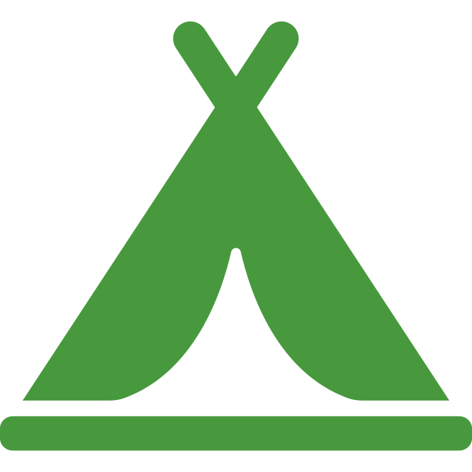

# POIViewerMap  
Point Of Interest Viewer Map is a .NET MAUI app for Android devices (iOS work in progress). It allows the user to choose a POI from a fixed list and display them on a map. 
POIs are orientated towards cycling and hiking. The app also supports import of a GPX route for display on the map.  

**Options:**  
* Import POIs for Country
* POI (To View)
* Search Radius (Kilometers)
* POIs Found (Visible on Map)
* Import GPX Route
* Route (GPX name If Imported)
* Center Map On My Position (Optional, uses more battery power)

 **Countries Covered:**
* Austria  
* Belguim  
* Bosnia-Herzegovina  
* Bulgaia  
* Croatia  
* Czech Republic  
* Estonia  
* France  
* Hungary  
* Iceland  
* Ireland and NI  
* Latvia  
* Lithuania  
* Luxembourg  
* Montenegro  
* Netherlands  
* Romainia  
* Serbia  
* Slovenia  
* Switzerland  
* UK  

**POIs Supported:**   
*  Drinking Water Point  
*  Campsite  
*  Bicycle Shop  
*  Bicycle Repair Station  
*  Supermarket  
*  ATM (Cash Machine)  
*  Toilet  
*  Cafe  
*  Bakery  
*  Picnic Table  
*  Train Station  
*  Vending Machine (Bread, Bicycle Tubes and Electronics only)
*  Laundry  

**Search Radius Supported:**  
* 5km  
* 10km  
* 20km  
* 75km  
* 100km  
## App Languages 
* English
* French (Français)
* German (Deutsch)
* Polish (Polski)
* Italian (Italiano)
* Latvian (Latviešu)
* 
## App Language Translations
https://hnd.www.deepl.com/  

## Screenshots  
**Andriod**  
      

## Minimum Requirments  
* Android 8
* iOS (Work in progress)
## Libraries Used  
* ReactiveUI https://www.reactiveui.net/  
* Flurl.Http (v3.2.4 only)  https://flurl.dev/   
* RolandK.Formats.Gpx https://github.com/RolandKoenig/RolandK.Formats.Gpx  
* Mapsui (v4.1.1 only) https://github.com/Mapsui/Mapsui
* POIBinaryFormatLib - used to deserialize POI binary objects https://www.nuget.org/packages/POIBinaryFormatLib/
## Road Map
* Work Offline
* Add more countries
* MVVM

## Licence
Copyright © 2024 SDSDevelopment

> This program is free software: you can redistribute it and/or modify
> it under the terms of the GNU General Public License as published by
> the Free Software Foundation, either version 3 of the License, or
> (at your option) any later version.
> 
> This program is distributed in the hope that it will be useful,
> but WITHOUT ANY WARRANTY; without even the implied warranty of
> MERCHANTABILITY or FITNESS FOR A PARTICULAR PURPOSE.  See the
> GNU General Public License for more details.
> 
> You should have received a copy of the GNU General Public License
> along with this program.  If not, see <https://www.gnu.org/licenses/>.
> 
> The author of this app cannot guarantee the accuracy of any POI that appears on the map. Discretion is required at all times whilst using the app.
 The data is extracted from [OpenStreetMap](https://www.openstreetmap.org) and relies on the many OSM contributors. Particular attention should be taken in regards to Drinking Water Points as there is no guarantee that any shown on the map are fit for drinking and the user must seek local knowledge.

Icons from: https://www.svgrepo.com/
