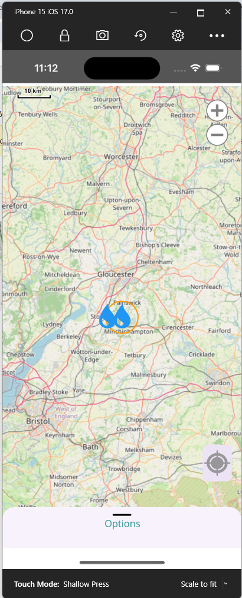

# POIViewerMap

**Point of Interest Viewer for Bicycle Touring & Hiking Adventures**

POIViewerMap is a powerful cross-platform mapping application built with .NET MAUI for Android and iOS. Designed specifically for outdoor enthusiasts, cyclists, and hikers, this app lets you discover and navigate to points of interest across 37+ European countries with offline-capable mapping powered by OpenStreetMap.

## 🌍 Key Features

- **Interactive POI Discovery**: Browse 15+ categories of points of interest including drinking water points, campsites, bicycle shops, repair stations, cafes, and more
- **Multi-Country Coverage**: Access comprehensive POI data across 37 European countries (UK, France, Germany, Italy, Spain, and more)
- **GPX Route Import**: Import and display your bicycle touring or hiking routes directly on the map
- **Customizable Search Radius**: Search for POIs within 1km, 5km, 10km, or 30km radius
- **Multi-Language Support**: English, French, German, Italian, Polish, and Dutch
- **OpenStreetMap Integration**: Utilizes OpenStreetMap for reliable, community-driven mapping data
- **Location-Based Services**: Center the map on your current position for real-time navigation

## 🗺️ Supported Countries

Albania • Andorra • Austria • Belarus • Belgium • Bosnia & Herzegovina • Bulgaria • Croatia • Czech Republic • Denmark • Estonia • Finland • France • Georgia • Germany • Greece • Hungary • Iceland • Ireland • Italy • Latvia • Liechtenstein • Lithuania • Luxembourg • Moldova • Netherlands • Norway • Poland • Portugal • Romania • Serbia • Slovakia • Slovenia • Spain • Sweden • Switzerland • Turkey • Ukraine • United Kingdom

## 🎯 Points of Interest (POIs)

POIViewerMap supports the following point of interest categories:

| Category | Icon |
|----------|------|
| Drinking Water Point |  |
| Campsite |  |
| Bicycle Shop |  |
| Bicycle Repair Station |  |
| Supermarket |  |
| Convenience Store |  |
| Charging Station (Mobile) |  |
| ATM / Cash Machine |  |
| Toilet |  |
| Cafe |  |
| Bakery |  |
| Picnic Table |  |
| Train Station |  |
| Vending Machine (Specialized) |  |
| Laundry |  |

## 📱 Screenshots

### Android
    

### iOS

## ⚙️ System Requirements

- **Android**: 8.0 or later
- **iOS**: 15.0 or later (tested on simulator only)

## 🔍 Search Radius Options

- 1 kilometer (local area)
- 5 kilometers (regional)
- 10 kilometers (extended search)
- 30 kilometers (wide area coverage)

## 🌐 Supported Languages

- English
- French (Français)
- German (Deutsch)
- Italian (Italiano)
- Polish (Polski)
- Dutch (Nederlands)

## 📦 Technology Stack

POIViewerMap is built with modern .NET technologies:

- **Framework**: [.NET MAUI](https://learn.microsoft.com/en-us/dotnet/maui/) - Cross-platform mobile development
- **UI Framework**: [ReactiveUI](https://www.reactiveui.net/) - MVVM and reactive programming
- **HTTP Client**: [Flurl.Http](https://flurl.dev/) - Fluent HTTP API
- **GPX Support**: [RolandK.Formats.Gpx](https://github.com/RolandKoenig/RolandK.Formats.Gpx) - Route parsing
- **Mapping**: [Mapsui](https://github.com/Mapsui/Mapsui) - Interactive mapping library
- **Serialization**: [protobuf-net](https://github.com/protobuf-net/protobuf-net) - Protocol Buffers
- **UI Components**: [Syncfusion.Maui.Toolkit](https://www.syncfusion.com/net-maui-toolkit) - Professional UI controls
- **POI Processing**: [POIBinaryFormatLib](https://www.nuget.org/packages/POIBinaryFormatLib/) - POI data deserialization
- **Geolocation**: [ReverseGeocodeLib](https://www.nuget.org/packages/ReverseGeocodeLib/) - Country and region detection

## 🗺️ Data Sources

- **Map Data**: [OpenStreetMap](https://www.openstreetmap.org) - Community-driven mapping
- **Map Tiles**: [Geofabrik Downloads](https://download.geofabrik.de/)
- **OSM Processing**: [Osmium Tool](https://osmcode.org/osmium-tool/)
- **License**: [ODbL](https://opendatacommons.org/licenses/odbl/)

## 📄 License

Copyright © 2026 SDSDevelopment

This program is free software: you can redistribute it and/or modify it under the terms of the **GNU General Public License v3.0** or later.

This program is distributed in the hope that it will be useful, but WITHOUT ANY WARRANTY; without even the implied warranty of MERCHANTABILITY or FITNESS FOR A PARTICULAR PURPOSE.

See the [GNU General Public License](https://www.gnu.org/licenses/gpl-3.0.html) for more details.

### Important Disclaimer

The author of this app cannot guarantee the accuracy of any POI displayed on the map. Discretion is required when using the app for navigation. POI data is extracted from OpenStreetMap and relies on community contributions.

## 🎨 Resources

- **Icons**: [SVGrepo](https://www.svgrepo.com/)
- **Translations**: [DeepL](https://hnd.www.deepl.com/)

## 🤝 Contributing

Contributions are welcome! To contribute:

1. Fork the repository
2. Create a feature branch (`git checkout -b feature/AmazingFeature`)
3. Commit your changes (`git commit -m 'Add some AmazingFeature'`)
4. Push to the branch (`git push origin feature/AmazingFeature`)
5. Open a Pull Request

## 📝 Getting Started

1. Clone the repository
2. Open in Visual Studio 2022 or Visual Studio Code with .NET MAUI extensions
3. Build and deploy to Android emulator, iOS simulator, or physical device
4. Start discovering points of interest on your next adventure!

## 🐛 Bug Reports & Feature Requests

Found a bug or have a feature request? Please [open an issue](https://github.com/stevegdavis/POIViewerMap/issues) on GitHub.

---

**Happy touring and hiking! 🚴‍♂️🥾**
