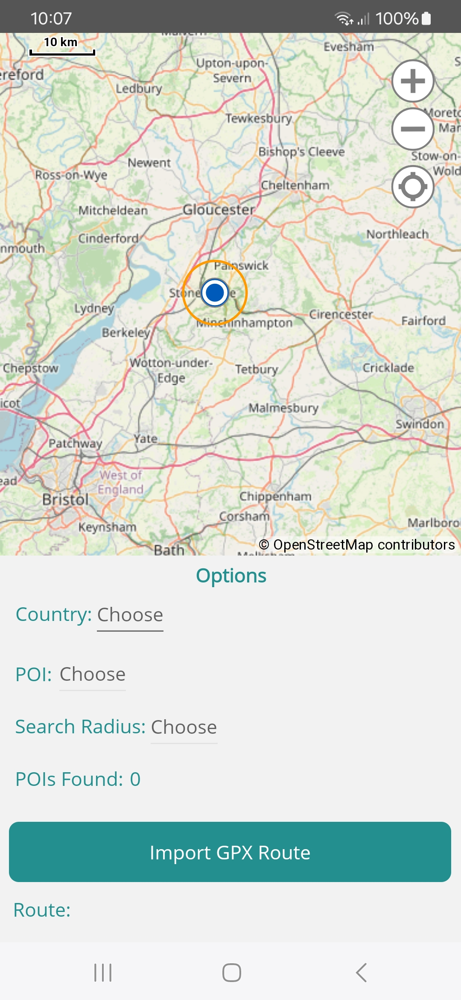
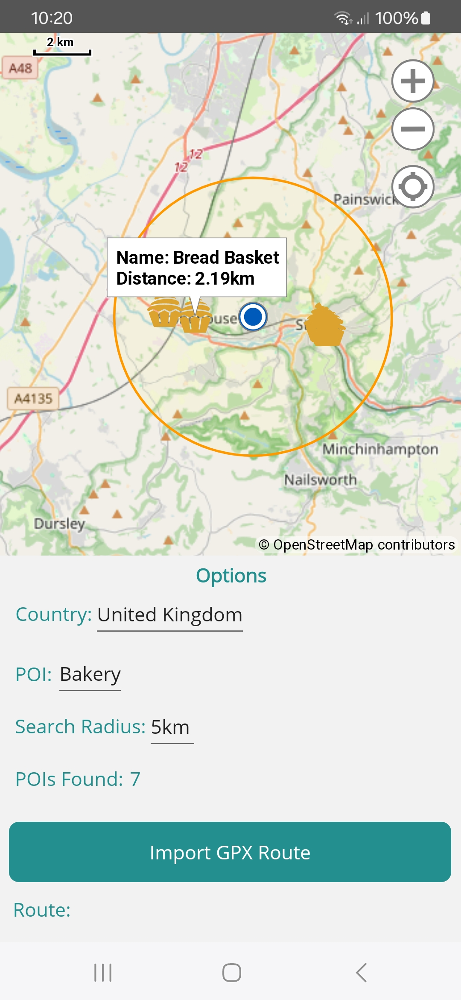
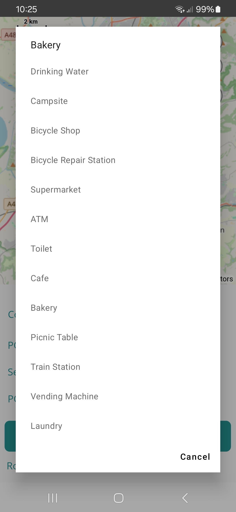

# POIViewerMap  
Point Of Interest Viewer Map is a .NET MAUI app for Android devices (iOS work in progress). It allows the user to choose a POI from a fixed list and display them on a map within a search radius from the users current location. 
POI's are oriented towards bicycle touring and hiking.  
The app also supports import of a GPX route for displaying on the map.  

**Map**  
Open Street Map - Online only  

**Options Panel**  
* Import POI's for Country from remote server
* POI (To View)
* Search Radius (Kilometers - distances shown are in a straight line)
* POI's Found (Visible on map)
* Import GPX Route
* Route (Imported GPX file name)
* Center Map On My Position (Uses more battery power)

 **Countries Covered**
* Albania
* Andorra
* Austria
* Belarus
* Belgium
* Bosnia Herzegovina
* Bulgaia  
* Croatia
* Czech Republic
* Denmark
* Estonia
* Finland
* France
* Georgia
* Germany
* Greece 
* Hungary  
* Iceland
* Ireland  
* Italy
* Latvia
* Liechenstien
* Lithuania  
* Luxembourg  
* Moldova
* Netherlands
* Norway
* Poland
* Portugal
* Romainia  
* Serbia
* Slovakia
* Slovenia
* Spain
* Sweden
* Switzerland
* Turkey
* Ukraine
* United Kingdom

**POI's Supported**   
*  Drinking Water Point  
*  Campsite  
*  Bicycle Shop  
*  Bicycle Repair Station  
*  Supermarket  
*  ATM (Cash Machine)  
*  Toilet  
*  Cafe  
*  Bakery  
*  Picnic Table  
*  Train Station (Excluding Tourist, Metro, Subway and Tram)  
*  Vending Machine (Bread, Bicycle Tubes and Electronics only)
*  Laundry  

**Search Radiuses Supported**  
* 5km  
* 10km  
* 20km
* 50km   
* 75km  
* 100km  
## App Languages 
* English
* French (Français)
* German (Deutsch)
* Italian (Italiano)
* Polish (Polski) 
* Netherlands (Nederlands)

## App Language Translations
https://hnd.www.deepl.com/  

## Screenshots  
**Android**  
       

## OS Minimum Requirments  
* Android 8
* iOS (TBC)
## Libraries Used  
* ReactiveUI https://www.reactiveui.net/  
* Flurl.Http (v3.2.4 only)  https://flurl.dev/   
* RolandK.Formats.Gpx https://github.com/RolandKoenig/RolandK.Formats.Gpx  
* Mapsui (v4.1.1 only) https://github.com/Mapsui/Mapsui
* POIBinaryFormatLib - used to deserialize POI binary objects from the country files https://www.nuget.org/packages/POIBinaryFormatLib/
* protobuf-net https://github.com/protobuf-net/protobuf-net
## OSM Conversion Software Used
osmium https://osmcode.org/osmium-tool/
## Open Street Map Data
https://download.geofabrik.de/
## Road Map  
* Work on iOS devices

## Licence
Copyright © 2025 SDSDevelopment

> This program is free software: you can redistribute it and/or modify
> it under the terms of the GNU General Public License as published by
> the Free Software Foundation, either version 3 of the License, or
> (at your option) any later version.
> 
> This program is distributed in the hope that it will be useful,
> but WITHOUT ANY WARRANTY; without even the implied warranty of
> MERCHANTABILITY or FITNESS FOR A PARTICULAR PURPOSE.  See the
> GNU General Public License for more details.
> 
> You should have received a copy of the GNU General Public License
> along with this program.  If not, see <https://www.gnu.org/licenses/>.
> 
> The author of this app cannot guarantee the accuracy of any POI that appears on the map. Discretion is required at all times whilst using the app.
 The data is extracted from [OpenStreetMap](https://www.openstreetmap.org) and relies on the many OSM contributors. Particular attention should be taken in regards to Drinking Water Points as there is no guarantee that any shown on the map are fit for drinking and the user must seek local knowledge.

Icons from: https://www.svgrepo.com/
