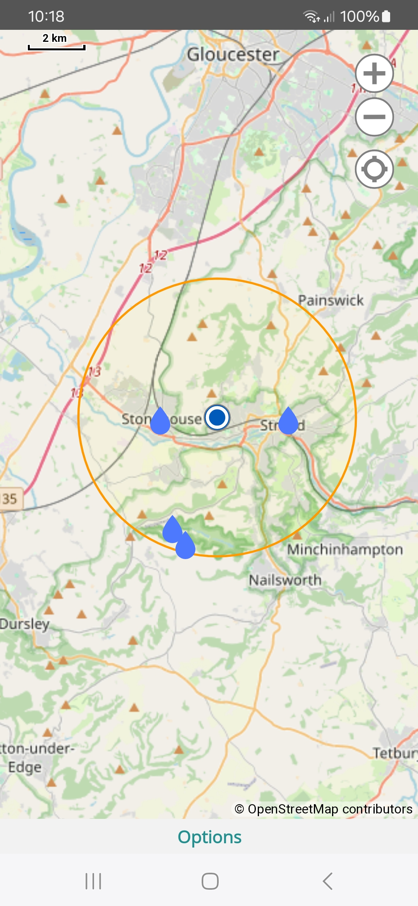

POI Viewer Map is a .NET MAUI app for Android devices (iOS to follow). It allows the user to choose a Place Of Interest from a fixed list and display them on a map. 
It is orientated towards cyling and hiking.  

**Options:**  
* Import POIs for Country
* POI (To View)
* Search Radius (Kilometers)
* POIs Found (Visible On Map)
* Import GPX Route
* Route (Name If Imported)
* Center Map On My Position (Option)

 **Countries Supported:**
* Austria  
* Belguim  
* Bosnia-Herzegovina  
* Bulgaia  
* Croatia  
* Czech Republic  
* Estonia  
* France  
* Hungary  
* Iceland  
* Ireland and NI  
* Latvia  
* Lithuania  
* Luxembourg  
* Montenegro  
* Netherlands  
* Romainia  
* Serbia  
* Slovenia  
* Switzerland  
* UK  

**POIs Supported:**   
* Drinking Water Point  
* Campsite  
* Bicycle Shop  
* Bicycle Repair Station  
* Supermarket  
* ATM (Cash Machine)  
* Toilet  
* Cafe  
* Bakery  
* Picnic Table  
* Train Station  
* Vending Machine (Bread, Bicycle Tubes and Electronics only)  

**Search Radius Supported:**  
* 5km  
* 10km  
* 20km  
* 75km  
* 100km  

## Screenshots  
  

ReactiveObject
RolandK.Formats.Gpx
Icons from: https://www.svgrepo.com/
